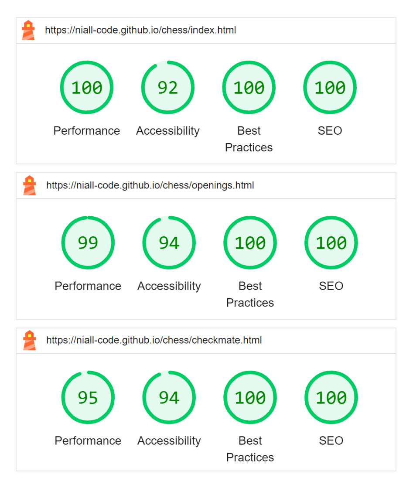

# How to Win Chess

'How to Win Chess' is a website about the game of chess. The target audience is people who have recently started playing chess, who know the rules but not much else. The key user goal is to expand their chess knowledge, for the purpose of being a stronger player and winning more of their games. The site owner goal is to help them do so in order to maximise their enjoyment of chess, inclining them to continue the hobby and share in the site owner's enthusiasm for it.

[The deployed project can be viewed here.](https://niall-code.github.io/chess/)

Currently, the chess openings page and checkmate patterns page have a relatively limited range of chess content. Adding further content would likely be ongoing for some time.

## Features

### Navigation menu

The navigation menu is in a fixed header so that it is immediately available without scrolling up. The navigation bar can widen and narrow in response to screen size. The menu's links grow when hovered to give feedback that a mouse cursor is over it and clicking now would select it. The current page is indicated with bolder text.

The site logo above also functions as a link back to the home page, as is commonly expected. The logo and menu are in the default serif font for aesthetic appeal, whereas the rest of the site's text is made sans serif for slightly improved readability, as is common practice for websites.

### Site introduction section

The site introduction section clarifies to the user the purpose of the website and the value it could provide. When it confirms the user's expectations or resonates with what they want, it should encourage them to continue exploring the site.

The introduction is set over a background image, a photo of a chess set. This gives visual interest to the landing page.

The size and placement of the introduction can respond to screen size. Similarly, the positioning of the background image can adjust for large screens.

### Mailing list signup form

The home page also has a simple form which would be for the user to sign up for weekly emails containing chess advice. The email input is set as required and is marked with a red asterisk, widely recognised as indicating a required field.

### External links

The footer has links to sites where chess can be played. They open in a new tab. Like the navigation menu, these links grow when hovered.

Font Awesome icons are utilised. They are some of the same icons as incorporated in the chessboard diagrams (discussed below). They also have some resemblance to logos of the corresponding sites, especially with the pawn icon being styled green.

### Chessboard diagrams

The chess openings and checkmate patterns pages include diagrams of the main chess positions described in the text, helping the user to visualise and understand the moves discussed.

The diagrams are consistent in style and the chess pieces have sufficient contrast against the sienna and linen square colors.

#### The 'Chess Graphic Maker'

The graphic maker is not integrated into the public-facing website. It is a tool for the developer, allowing images to be created with a consistent style when adding further openings and checkmates to the site. It is intended to be opened and utilised from within a code editor. Its HTML file (chess-graphic-maker.html) has a dedicated stylesheet (assets/css/chess-graphic-style.css) that makes the essential table element resemble a chess board. Instructions are included in the HTML file but in summary, font icons are inserted in the appropriate cells and a screenshot is taken of the result.

- History of the idea

  Originally, I planned to have multiple lengthy table elements in the HTML code, one for each diagram - like the table that is now in chess-graphic-maker.html. The main advantage of this would have been that it could be easily edited or duplicated, without opening a separate file or cropping and optimising images and adding them to the project as assets. My main concern was accessibility, whether a person reliant on a screen reader would be able to make sense of the table. Screenshotting the generated diagrams and putting them back in as simple images with an alt attribute seemed a necessary solution.

  I subsequently discovered that just giving the table a role attribute with an img value and an aria-label attribute may have been sufficient to similarly prevent a screen reader from trying to interpret the table, instead treating it as a unified image with an alt equivalent. Given the limited time frame of the project, the original solution has been retained. Reverting from images to tables would have meant deleting a significant amount of work and repeating some previous work. Since the site is functioning soundly in its current form, this seemed an unwise use of time.

### Audio of text

Voice recordings of the explanatory textual content about the opening positions and checkmate patterns are provided. This gives site users the options of listening to the paragraphs instead of reading them or listening and reading along at the same time.

The placement of the audio bar immediately below the paragraphs makes it intuitive that it would be audio of the text. However, an aria-label attribute is included to ensure that its purpose is also clear to those who rely on screen readers.

If the site user is unfamiliar with standard algebraic chess notation, the audio would also help them understand and learn it. For example, the text "Qa4+" is spoken as "queen to a4, check". This allows them to pick it up in a natural manner.

## Credits/Sources

- Background image

  The [background image](https://www.pexels.com/photo/chess-pieces-on-the-board-6114955/) of the site introduction section on the home/landing page was found on Pexels and had been taken by a person called Vlada Karpovich.

- Chessboard diagrams & Links in footer

  The diagrammatic images incorporate [Font Awesome](https://fontawesome.com/search?q=chess&o=r&m=free) chess piece icons. The symbols accompanying the external links in the footer are Font Awesome icons from the same source.
  
  Besides that, the diagrams were self-made with my 'chess graphic maker'.

- Optimisation & README screenshots

  The background image, chessboard diagrams, and the screenshots featured in this README were all optimised using [Tiny PNG](https://tinypng.com/), often reducing the file size by more than half.

  The cross-device responsiveness mockup at the top of this document was generated with [am-i-responsive](https://ui.dev/amiresponsive).

  Microsoft PowerPoint was used to group screenshots together into one image, for the subsection on the chessboard graphic maker feature and for some Lighthouse statistics in the testing section. It was also used to obscure a company name, for a mobile screenshot in the testing section.

- Textual content

  The site introduction, page introductions, and the paragraphs about chess openings and checkmate patterns were all self-written.
  
  The contents of the opening and checkmate paragraphs are a combination of my own existing knowledge and details learnt from consulting Wikipedia's lists of [chess openings](https://en.wikipedia.org/wiki/List_of_chess_openings) and [checkmate patterns](https://en.wikipedia.org/wiki/Checkmate_pattern). I read the Wikipedia entries only once, intending to minimise the risk of my writing inadvertently copying the reference material too closely.

- Audio

  The audio is self-made. It was recorded with a Blue Yeti microphone. Audacity was used to remove the background static, increase the volume, and trim the recording.

- Favicon

  The favicon was self-created, using [this site](https://www.favicon.cc/).

## Testing

Throughout the project, I frequently used live previews to see that my work looked and behaved as I expected, and generally made immediate minor code changes if it did not. Similarly, Google dev tools was often used to check how the site would appear on different devices.

Since deployment, I have clicked all links both navigational and external to confirm that they are functional, checked that the form responds as expected both when correctly completed and when lacking a valid email address, and confirmed that the audio content plays and pauses on command. I noticed that one audio file unintentionally still had eight seconds of silence at its beginning, which I then promptly fixed using Audacity.

Having earlier consulted [can-i-use](https://caniuse.com/?search=.ico) to judge that I could expect my favicon to work on iOS devices, after deployment I checked it by opening my site on an iOS tablet and mobile. You can see a mobile screenshot below. I found that the favicon does display in the tab along with the title, which was my main intention. I also found that its symbol when showing up as a recent site was not the favicon but rather an N, presumably taken from the initial of niall-code, my GitHub username. However, the maroon color from the favicon interestingly still appears to have been drawn upon. A company's website that happened to be alongside shows similar behaviour, an automatically chosen letter and color seemingly based on available information. Overall, I am satisfied with the results.

With the help of relatives, my deployed site was viewed on both Android and iOS mobiles, on a tablet, and on Windows laptops in both Chrome and Edge. No bugs were discovered.

I ran each of my HTML and CSS files through validators ([W3C Markup Validation](https://validator.w3.org/) and [W3C CSS Validation](https://jigsaw.w3.org/css-validator/), respectively). The sole error reported was the use of a controlslist attribute with a value of nodownload on the audio elements. For me, the attribute had the intended effect. I understand that it registered as an error because the attribute is not recognised by every common browser. However, since not downloading the audio is preferred but non-critical, I do not consider this to be a bug for my particular project.

I used Google dev tools' Lighthouse feature to test statistics for each of my three web pages and received positive scores, as seen below.

## Gitignore

My .gitignore file is currently empty because there are no automatically generated or sensitive files in the directory tree which require an ignore instruction. However, the .gitignore is present anyway as good practice, in case of being needed in the future.

## Deployment

Git was used for version control and GitHub for a remote repository, as is common practice.

The deployment of my project was straightforward. From my GitHub repository, I went to Settings, then Pages. 'Deploy from a branch' was the default for the source. For the branch, I selected 'main' (which, for this solo project, was also the only branch), and the root directory was the default for the second dropdown. I clicked Save and the project was deployed with GitHub Pages as a live website with its own URL: https://niall-code.github.io/chess/.

Since my earliest deployment, I had:
- added comments to the graphic maker files and reordered some of its CSS file's rulesets,
- moved the graphic maker files from a shared folder to more standard positions in the directory tree based on their file types, sensibly renamed them, and altered the HTML file's path to the CSS file accordingly,
- updated an audio file, as mentioned in the testing section,
- written the contents of this README file,
- and added the image assets that this file utilises.

From my GitHub repository page (https://github.com/niall-code/chess), the repository can easily be forked by clicking the 'Fork' button near the top right of the screen.

By clicking the green 'Code' button, again towards the top right, you could also reveal the address required to clone the repository. You would then use Git to make the clone, either with a `git clone` command followed by the address in a terminal (after navigating into an appropriate directory for the clone's destination) or alternatively by clicking a "Clone Repository" button and entering the address, in some code editors with Git integration.