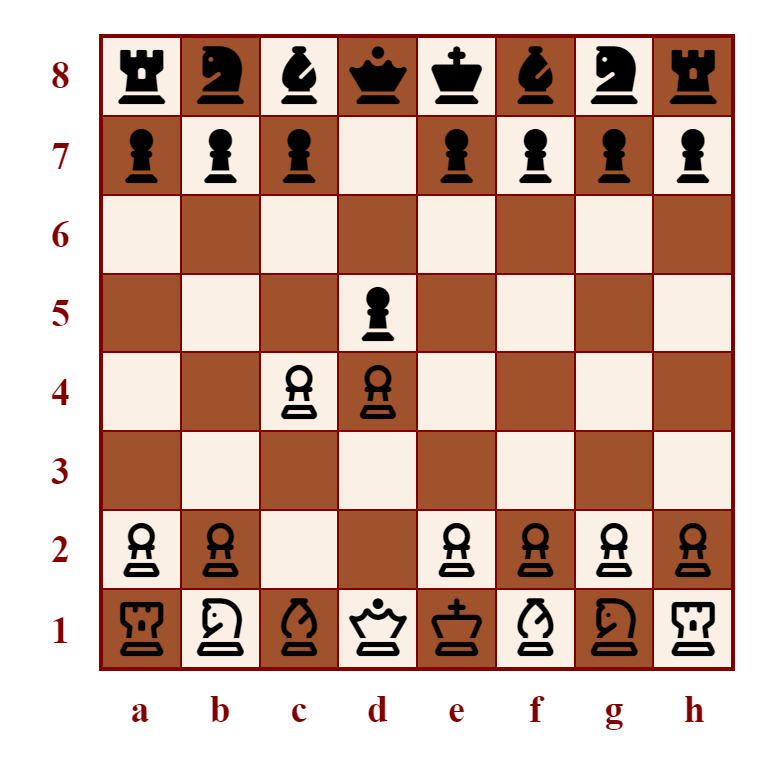

# How to Win Chess

'How to Win Chess' is a website about the game of chess. The target audience is people who have recently started playing chess, who know the rules but not much else. The addressed user goal is to expand their chess knowledge, for the purpose of being a stronger player and winning more of their games. The site owner goal is to help them do so in order to maximise their enjoyment of chess, inclining them to continue the hobby and share in the site owner's enthusiasm for it.

[The deployed project can be viewed here.](https://niall-code.github.io/chess/)

Currently, the chess openings page and checkmate patterns page have a relatively limited range of chess content. Adding further content would likely be ongoing for some time.

## Features

### Navigation menu

The navigation menu is in a fixed header so that it is immediately available without scrolling up. The navigation bar can widen and narrow in response to screen size. The menu's links grow when hovered to give feedback that a mouse cursor is over it and clicking now would select it. The current page is indicated with bolder text.

The site logo above also functions as a link back to the home page, as is commonly expected.

### Site introduction section

The site introduction section clarifies to the user the purpose of the website and the value it could provide. When it confirms the user's expectations or resonates with what they want, it should encourage them to continue exploring the site.

The introduction is set over a background image, a photo of a chess set. This gives visual interest to the landing page.

The size and placement of the introduction can respond to screen size. Similarly, the positioning of the background image can adjust for large screens.

### Mailing list signup form

The home page also has a simple form which would be for the user to sign up for weekly emails containing chess advice. The email input is set as required and is marked with a red asterisk, widely recognised as indicating a required field.

### External links

The footer has links to sites where chess can be played. They open in a new tab. Like the navigation menu, these links grow when hovered.

Font Awesome icons are utilised. They are some of the same icons as incorporated in the chessboard diagrams (discussed below). They also have some resemblance to logos of the corresponding sites, especially with the pawn icon being styled green.

### Chessboard diagrams

#### The 'Chess Graphic Maker'

It is intended to be opened and utilised from within a code editor.

### Audio of text

Voice recordings of the explanatory textual content about the opening positions and checkmate patterns are provided. This gives site users the options of listening to the paragraphs instead of reading them or listening and reading along at the same time.

The placement of the audio bar immediately below the paragraphs makes it intuitive that it would be audio of the text. However, an aria-label attribute is included to ensure that its purpose is also clear to those who rely on screen readers.

If the site user is unfamiliar with standard algebraic chess notation, the audio would also help them understand and learn it. For example, the text "Qa4+" is spoken as "queen to a4, check". This allows them to pick it up in a natural manner.

### Favicon

## Credits/Sources

- Background image

  The [background image](https://www.pexels.com/photo/chess-pieces-on-the-board-6114955/) of the site introduction section on the home/landing page was found on Pexels and had been taken by a person called Vlada Karpovich.

- Chessboard diagrams

  The diagrammatic images incorporate [Font Awesome](https://fontawesome.com/search?q=chess&o=r&m=free) chess piece icons.
  
  Besides that, those images were self-made with my 'chess graphic maker'.

- Textual content

  The site introduction, page introductions, and the paragraphs about chess openings and checkmate patterns were all self-written.
  
  The contents of the opening and checkmate paragraphs are a combination of my own existing knowledge and details learnt from consulting Wikipedia's lists of [chess openings](https://en.wikipedia.org/wiki/List_of_chess_openings) and [checkmate patterns](https://en.wikipedia.org/wiki/Checkmate_pattern). I read the Wikipedia entries only once, intending to minimise the risk of my writing inadvertently copying the reference material too closely.

- Audio

  The audio is self-made. It was recorded with a Blue Yeti microphone. Audacity was used to remove the background static, increase the volume, and trim the recording.

## Testing

### Bugs

## Deployment
